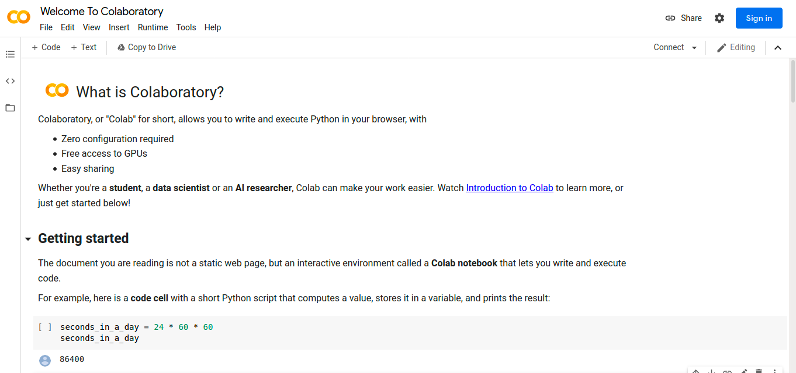
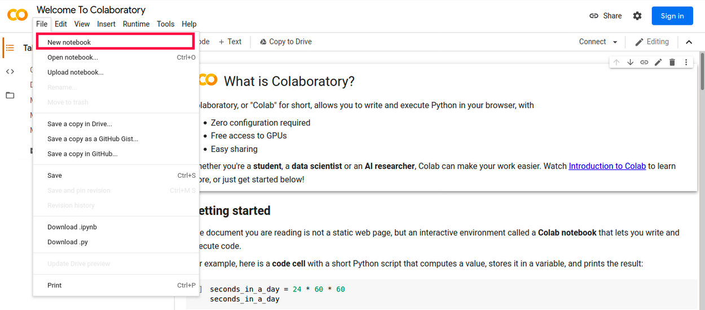

---


---
#### SQUAD: SLASHICORP
#### STUDENTS:
- [RM85619 - Allan Phyllyp Reis](https://www.linkedin.com/in/allan-reis-997b82171/)
- [RM84082 - Dihogo Cassimiro Teixeira](https://www.linkedin.com/in/dihogoteixeira/)
- [RM85833 - Fernando Borgatto Bouman](https://www.linkedin.com/in/fernando-borgatto-bouman-821534b9/)
- [RM86486 - Paloma Rangel Rocha](https://www.linkedin.com/in/palomara/)
- [RM85468 - Juan Carlos Benvive Serrano](https://www.linkedin.com/in/juan-carlos-benvive-serrano-529615195/)
---
#### SUBJECTS:
- DISRUPTIVE ARCHITECTURES: IOT & IA
---
#### PRESENTATION:
[](https://www.youtube.com/watch?v=GCC7kFPmp7w)

---
#### COMO USAR O COLAB?

A primeira coisa que precisamos fazer para usar o google Colab é acessar o seguinte endereço:

[https://colab.research.google.com/notebooks/intro.ipynb](https://colab.research.google.com/notebooks/intro.ipynb)

Logo seremos direcionados para um notebook chamado Welcome to Colaboratory:



Esse notebook explica algumas características do `Colab` e mostra como dar os primeiros passos (recomendo a leitura).
**As principais são**:

- Como roda em uma máquina do google, não precisamos realizar qualquer configuração.
- O google disponibiliza gratuitamente acesso a GPU’s.
- É simples de compartilhar, igual a qualquer arquivo contido no drive.

Ok, já li e entendi o que é o Colaboratory, mas quero criar meu próprio notebook! 
Para fazer isso, precisamos clicar em `>File`, na parte superior esquerda, logo em seguida em `>New Notebook`. 

#### Veja figura abaixo:



Feito, agora tem acesso ao seu ***Google Colab***, realize o ‘upload’ do `dataset_tomate.csv` no **Google Drive** numa pasta da sua preferência. 
Mas não se esqueça de alterar o nome da `Pasta` do **Google Drive**, em que o DataSet `.csv` foi carregado.
Esta alteração deve ser realizada na linha `12` do arquivo `knn_tomato.ipynb`, 
alterando a variável de referência `{{ PASTA }}` pelo nome da sua pasta, na função `open()`:

```thymeleafexpressions
11 
12  with open('/content/drive/My Drive/{{ PASTA }}/dataset_tomate.csv', 'r') as dataset:
13 
```